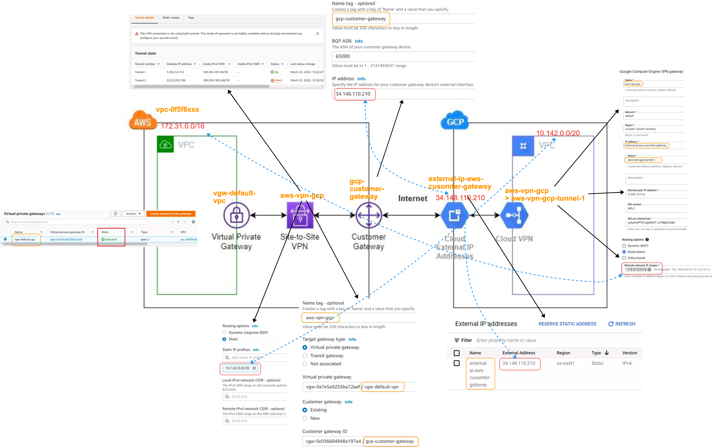
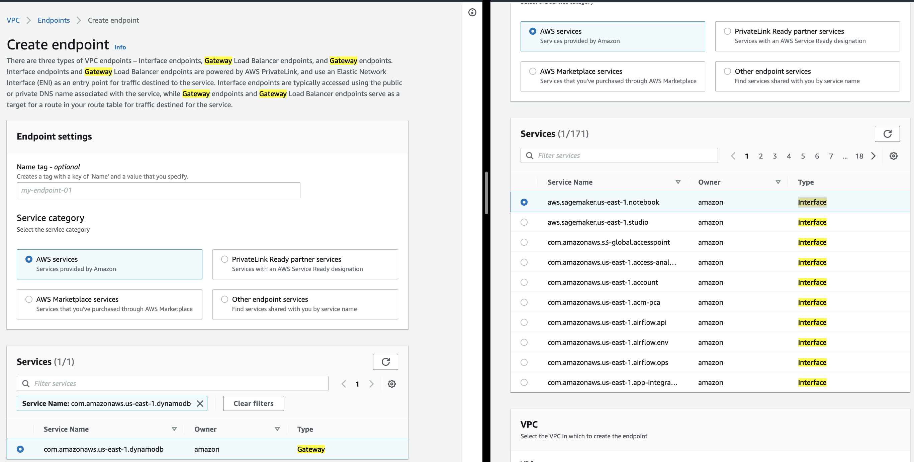
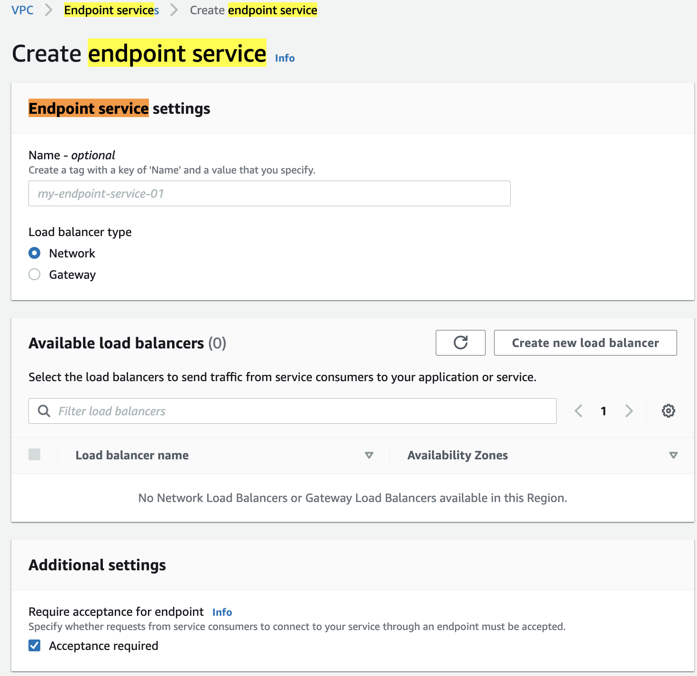

# aws-vgw-vpn-cgw-connect2-gcp 🐳

## VGW & VPN & CGW

1. ### reference
    [viblo](https://viblo.asia/p/aws-practice-connect-vpc-network-between-aws-and-gcp-use-vpn-gDVK2rM0KLj)
1. ### setting SG of AWS & GCP
    [securitygroup](https://viblo.asia/p/aws-practice-connect-vpc-network-between-aws-and-gcp-use-vpn-gDVK2rM0KLj#_enable-security-group-10)

## more info

1. ### Client VPN Endpoint
    - different with VGW: connect to VPC FROM individual, NOT whole data center!
    
1. ### transit GW
    - Transit Gateway như 1 cái trung tâm (hub), nhiều VPC thì thay vì VPC peering chồng chéo với nhau theo kiểu lưới (grid) thì nối về 1 hub - sẽ gọn hơn
    - các nối single này thì cũng cần dùng thêm (direct connect hoặc VPN) - trong hình đã được lược giản
    - 1/ endpoint  là VPC : nối trực tiếp về transit gateway (VPC=> TransitGateway)
    - 2/ endpoint là on_premise:
    - 2-1/ On_premises là data center cần heavy transfer  => Direct Connect => TransitGateway
    - 2-2/ On_premise là branch office ko cần heavy transfer và bảo mật cao => Customer Gateway => IPSecVPC => [AWS Site-to-Site VPN] => TransitGateway
    
    - Ngoài ra khi scale lên thì có thể có nhiều TransitGateway ở các country khác nhau thì có thêm “peering connection” giữa các Transit Gateway
1. ### private link
    - (A) Endpoint và (B) Endpoint services=`private link`
    - (A) = (A1) interface + (A2) GW
    - tạo (A) endpoint DNS name để kết nối với VPC chính -> output (A) is DNS names, ex: `vpce-*`
    - để tạo endpoint thì phải chọn service name: S3/DynamoDB (A2) hoặc các service khác (A1)
    
    - TH service ko phải là service có sẵn của AWS mà service chính là 1 app trên 1 VPC khác thì tạo (B) -> output (B) is service name, ex: `xxx.aws...servicename`
    